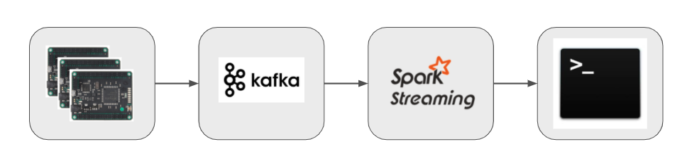

# Sketching a real-time analytics pipeline in Python



## Overview

This project demonstrates how to build a real-time streaming application in which simulated JSON data is fed into a Kafka topic to be consumed by a Spark Structured Streaming application. The application groups the incoming sensor data by device and produces a summary of the average IoT device temperature over a rolling window of specified length. The input data is not real, but mocks three drones that
move in three dimensions and emit their position and temperature through sensor data, which an observer might be interested in monitoring. For instance, if you observe temperature spikes on a device, you might want to give it a break. If the device doesn't move for a while, it might be broken and needs to be scheduled for repair etc.

The summary is simply printed to command line, but you could relatively easily add other consumers like Elastic Search and display the stream-processed data in a dashboard like Kibana. 


## Running the demo

After installing and running all dependencies, as described below, clone this repository:

```
git clone git@github.com/maxpumperla/iot-demo.git
cd iot-demo
virtualenv venv && source venv/bin/activate
pip install -r requirements.txt
```

You can now start your Spark Streaming application like this:

```
spark-submit --packages org.apache.spark:spark-sql-kafka-0-10_2.11:2.4.5 consume.py
```

Note that the Spark package version numbers need do match your Kafka, Scala and PySpark versions, respectively. This application will watch for any incoming events from a specified Kafka topic and processes the stream data regularly.

To feed simulated data into the application, simply run (in a new shell tab):

```
python produce.py
```

As data pours into Kafka, you should see a growing table with summary statistics in the shell in which you started the streaming application. The output should look like this:

```text
-------------------------------------------
Batch: 0
-------------------------------------------
+---------+------------+----------+---------------+
|device_id|window_start|window_end|avg_temperature|
+---------+------------+----------+---------------+
+---------+------------+----------+---------------+

-------------------------------------------
Batch: 1
-------------------------------------------
+---------+-------------------+-------------------+----------------+
|device_id|       window_start|         window_end| avg_temperature|
+---------+-------------------+-------------------+----------------+
|        1|2019-10-01 09:00:00|2019-10-01 09:20:00|  38.40295933694|
|        1|2019-10-01 09:20:00|2019-10-01 09:40:00|65.3028870223125|
+---------+-------------------+-------------------+----------------+
...
```

## Installing dependencies

We'll discuss how to install Kafka and Spark on Mac only. Linux instructions should be easily found. Good luck on Windows!

### Kafka

```bash_script
brew cask install homebrew/cask-versions/adoptopenjdk8
brew install kafka
```

To have `launchd` start kafka immediately and restart at login

```bash_script
  brew services start kafka
```

If you don't want a background service you can just run

```
zookeeper-server-start /usr/local/etc/kafka/zookeeper.properties & kafka-server-start /usr/local/etc/kafka/server.properties
```

### Spark

```
brew install scala
brew install apache-spark
```

